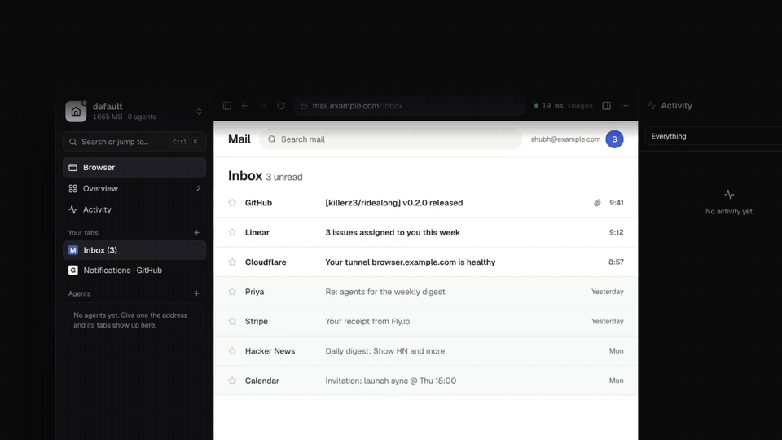
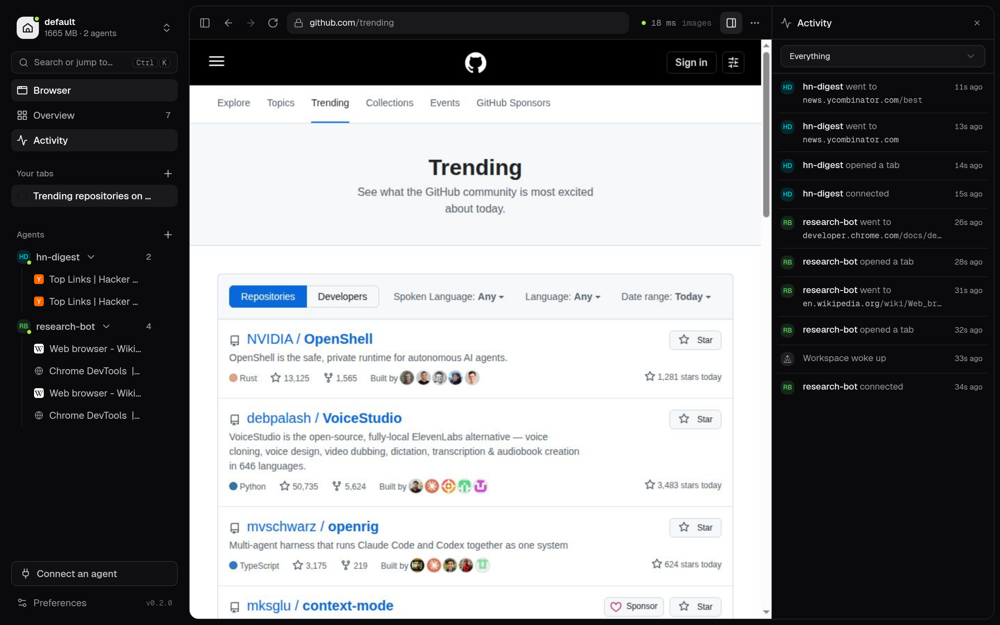
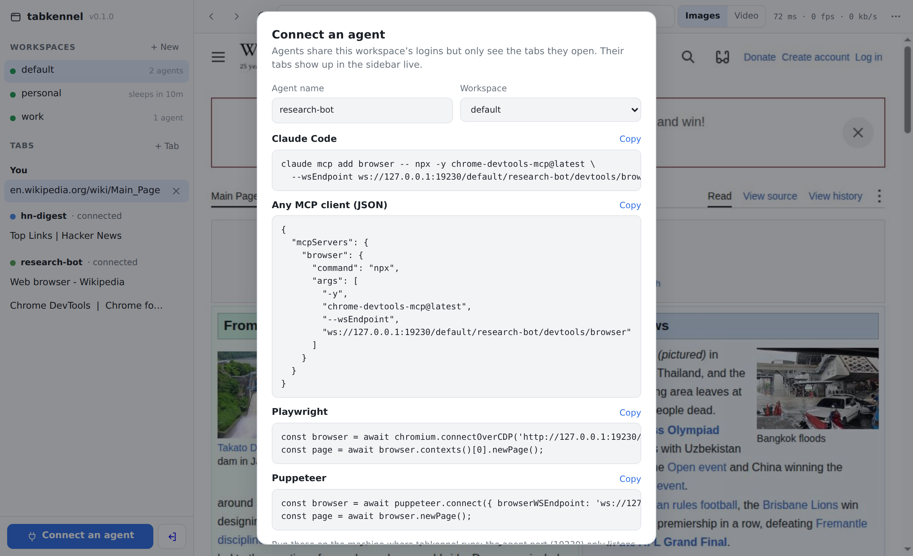
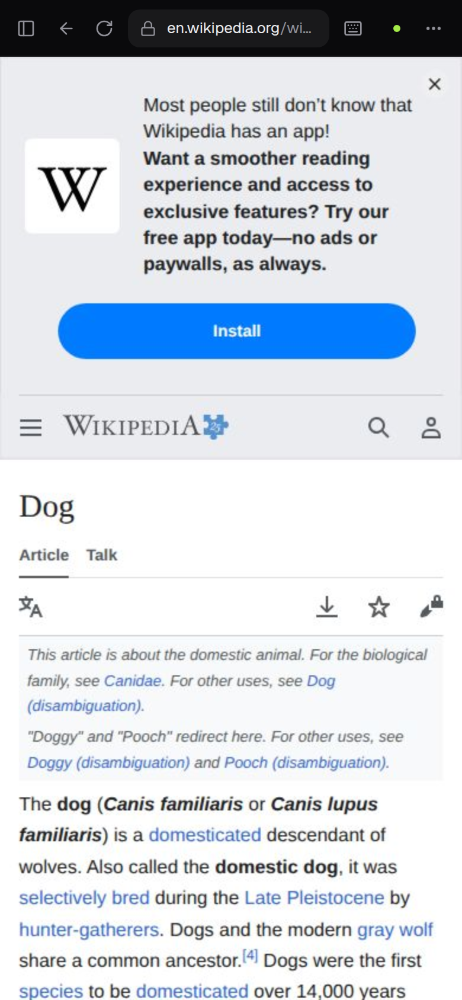
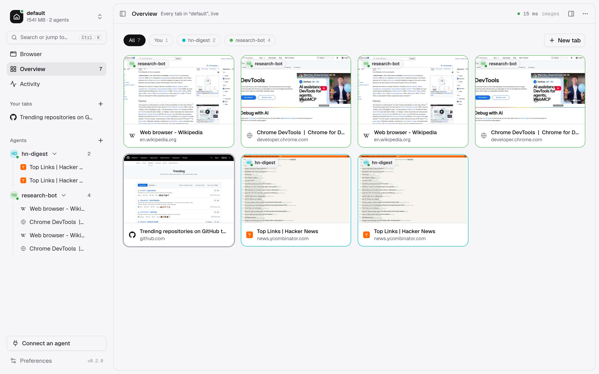

<p align="center">
  
</p>

<h1 align="center">ridealong</h1>

<p align="center"><b>Your agents ride along in your browser.</b><br>
One logged-in Chrome for you and your AI agents: self-hosted, per-agent tabs, workspaces that sleep when idle.</p>

<p align="center">
  <a href="https://ridealong.kz3.dev/">Website</a> ·
  <a href="#quick-start">Quick start</a> ·
  <a href="#connect-an-agent">Connect an agent</a> ·
  <a href="#security-model">Security</a>
</p>

<p align="center">
  <a href="https://github.com/killerz3/ridealong/releases/latest"></a>
  <a href="LICENSE"></a>
  
  
</p>

<p align="center">
  <a href="https://github.com/killerz3/ridealong/releases/download/v0.3.0/ridealong-launch.mp4"></a><br>
  <sub>▶ <a href="https://github.com/killerz3/ridealong/releases/download/v0.3.0/ridealong-launch.mp4">Watch the 42-second launch video</a></sub>
</p>

ridealong runs real Chrome on your server. You open it from any browser or your phone, sign in to your sites once, and your agents use that same logged-in Chrome over CDP. Each agent only sees the tabs it opened.



- **Your logins, shared safely.** Sign in once (Gmail, GitHub, LinkedIn, your internal tools). Agents work as you, each in its own tabs. They can't see or touch your tabs or each other's.
- **You can step in.** When an agent hits a captcha, 2FA prompt or "is this you?" page, you open the viewer and answer it.
- **Workspaces.** Separate profiles with separate logins, for example `personal` and `work`. Each one runs its own Chrome.
- **No RAM when idle.** A workspace nobody is using goes to sleep after 10 minutes (configurable): its Chrome is stopped and its tabs are saved. The next person or agent to connect wakes it in about 2 seconds, and agents get their tabs back.
- **Fast on slow links.** The viewer only sends a new frame once the previous one has arrived. It never builds a backlog, so what you see stays current. An optional H.264 video mode gives smooth scrolling.
- **Works on a phone.** Your tabs render at your screen's size, sites get a mobile browser, and you get touch scrolling and an on-screen keyboard.
- **See what your agents are doing.** A live activity feed shows each agent connecting, opening tabs and browsing. An overview shows every tab as a live thumbnail. You can disconnect an agent, close its tabs, or block it.
- **Files both ways.** When a page asks for a file, you pick it on your device and it's handed to the page. Anything the browser downloads, yours or an agent's, can be saved to your device.
- **Fast to get around.** <kbd>Ctrl</kbd>/<kbd>⌘</kbd> <kbd>K</kbd> jumps to any tab or workspace, opens an address or runs a command. Light and dark themes.
- **No root needed.** It's a Node process plus Xvfb. Run it as a normal user under systemd, or in Docker. It also runs on a Mac, headless, with no Xvfb at all.

## Quick start

On a Linux server or VM with Node 20+:

```sh
sudo apt-get install -y xvfb ffmpeg      # ffmpeg is optional (video mode)
npm install -g https://github.com/killerz3/ridealong/releases/latest/download/ridealong.tgz
ridealong setup
```

`setup` checks your system and downloads Chromium if you don't have one (about 170 MB, no root). It then sets a viewer password and offers to install a systemd user service, so ridealong keeps running in the background and starts on boot.

Open **http://127.0.0.1:8083** and sign in. On a remote server, use `ssh -L 8083:127.0.0.1:8083 your-server` or [put it behind a tunnel](#reach-it-from-anywhere).

### macOS

With Node 20+ and Google Chrome installed:

```sh
npm install -g https://github.com/killerz3/ridealong/releases/latest/download/ridealong.tgz
ridealong setup
```

`setup` finds Chrome in `/Applications` (or downloads Chromium), sets the viewer password and offers to install a launchd agent, so ridealong runs in the background and starts when you log in.

On a Mac, each workspace's Chrome runs **headless**, because macOS has no Xvfb. Everything works the same except:

- **No video mode.** The viewer uses Images mode, which is the default anyway.
- **Memory figures are RSS**, so they read higher than on Linux.
- Headless Chrome presents itself as normal Chrome, but a few sites may still spot it. If one won't let you sign in, sign in from the viewer and let your agents reuse the session.

### Docker

```sh
git clone https://github.com/killerz3/ridealong && cd ridealong
echo "RIDEALONG_PASSWORD=$(openssl rand -base64 18)" > .env
docker compose up -d
```

Both ports are published on `127.0.0.1` only. Profiles live in the `ridealong-data` volume.

## Connect an agent

Click **Connect an agent** in the viewer, or run `ridealong connect <agent-name>`. The viewer gives you ready-to-paste setup for Claude Code, Codex, any MCP client, Playwright and Puppeteer, and tells you the moment your agent connects.



The snippets look like this:

```sh
# Claude Code (or any MCP client) via Chrome DevTools MCP
claude mcp add browser -- npx -y chrome-devtools-mcp@latest \
  --wsEndpoint ws://127.0.0.1:9230/default/research-bot/devtools/browser
```

```js
// Playwright
const browser = await chromium.connectOverCDP('http://127.0.0.1:9230/default/research-bot');
// Puppeteer
const browser = await puppeteer.connect({ browserWSEndpoint: 'ws://127.0.0.1:9230/default/research-bot/devtools/browser' });
```

The address is `ws://127.0.0.1:9230/<workspace>/<agent>/devtools/browser`:

- **`<agent>`** is any name you choose. It labels the agent's tabs in the viewer and scopes what it can see. Give each agent its own name.
- **`<workspace>`** picks which profile (which set of logins) the agent uses. If the workspace doesn't exist, it is created. If it's asleep, it wakes up.
- The older form `/<agent>/devtools/browser` uses the `default` workspace.

A long-running agent keeps working across sleeps. When its workspace goes to sleep the connection closes, and Chrome DevTools MCP reconnects on the next tool call, which wakes the workspace and restores its tabs.

## Workspaces and sleep



Each workspace is its own Chrome profile running in its own Chrome on its own virtual display. Logins, cookies and history never mix between them.

A workspace stays **awake** while you have it open in a visible viewer tab or an agent keeps sending commands. After `idleMinutes` with neither (10 by default), it goes **to sleep**: Chrome saves its session and exits, so the workspace uses no memory. It wakes when you select it in the viewer or an agent connects.

Change the timer for all workspaces with `idleMinutes` in the config. Change it for one workspace from the **⋯** menu in the viewer (2 minutes up to never). That menu also has **Put to sleep now** and **Delete workspace**.

```sh
ridealong status          # which workspaces are awake, who is connected
ridealong sleep work      # stop a workspace's browser now
ridealong wake work
```

## The viewer



- **Sidebar.** Switch workspaces from the top; each shows whether it's awake and how much memory it uses. Below are your tabs, then one group per agent with a dot that's lit while it's connected. The ⋯ next to an agent closes its tabs, disconnects it or blocks it.
- **Overview** shows every tab as a thumbnail that refreshes while you look. Filter by agent, click one to take it over.
- **Activity** is a live feed of what agents do in this workspace: connections, new tabs, every page they go to, downloads.
- **Search** (<kbd>Ctrl</kbd>/<kbd>⌘</kbd> <kbd>K</kbd>) finds tabs by title, address or agent, switches workspaces, and runs anything in the menus. Type an address to open it.
- **Watching an agent's tab** draws a ring in its colour around the page. You can still click and type; the agent keeps its tab.
- **Uploads and downloads.** A file input on the page opens a picker on your device. Downloads appear under the download button in the toolbar.
- **Screenshot** (⋯ menu) saves the current page as a PNG.

- **Images** mode (the default) streams JPEG frames only when the page changes. Pacing and quality adapt to your connection, and it works in every browser.
- **Video** mode streams H.264 from the workspace's display, decoded in your browser with WebCodecs. Scrolling and animation are smoother, but the server uses more CPU while you watch. It needs `ffmpeg` on the server and https or localhost in the browser.
- Tabs you open render at the size of your viewer. Agents' tabs keep their own size, so watching an agent doesn't change what it sees.
- Copy (Ctrl/Cmd+C) copies the page's selection to your clipboard. Paste types your clipboard into the page. JS alerts and confirms appear as dialogs you can answer.
- The dot and number in the toolbar show the round trip. Click it for frames per second, bandwidth and the Images/Video switch.

On a 4 Mbit/s link with 30 ms latency, streaming a busy animated page, the picture was **56 ms old at the median (p95 101 ms)**. A viewer that acknowledges frames as soon as the server sends them (ridealong's predecessor did this) fell **8 to 12 seconds** behind on the same link.

## Reach it from anywhere

Only expose the **viewer** port (8083). Never expose the agent port (9230): anything that can reach it is signed in as you everywhere.

**Cloudflare Tunnel** (no open ports). Add Cloudflare Access in front for a second login:

```yaml
# /etc/cloudflared/config.yml
ingress:
  - hostname: browser.example.com
    service: http://127.0.0.1:8083
  - service: http_status:404
```

**Caddy** (automatic HTTPS):

```
browser.example.com {
  reverse_proxy 127.0.0.1:8083
}
```

Video mode and clipboard copy need HTTPS, which both of these provide.

## Configuration

`ridealong setup` writes `~/.ridealong/config.json`. Environment variables override it.

| Setting | Env var | Default | |
|---|---|---|---|
| `password` | `RIDEALONG_PASSWORD` | set by setup | viewer password |
| `viewerPort` | `RIDEALONG_PORT` | `8083` | web viewer |
| `agentPort` | `RIDEALONG_AGENT_PORT` | `9230` | CDP for agents |
| `bind` | `RIDEALONG_BIND` | `127.0.0.1` | interface both ports listen on |
| `idleMinutes` | `RIDEALONG_IDLE_MINUTES` | `10` | sleep after this long unused; `0` = never |
| `screen` | `RIDEALONG_SCREEN` | `1920x1200` | virtual display per workspace (largest page size) |
| `fps` | `RIDEALONG_FPS` | `30` | video mode frame rate |
| `chrome` | `RIDEALONG_CHROME` | auto | path to Chrome/Chromium |
| `sandbox` | `RIDEALONG_SANDBOX` | `auto` | Chrome's sandbox; auto turns it off where it can't run |
| `headless` | `RIDEALONG_HEADLESS` | `auto` | headless Chrome, no Xvfb or video mode; auto is on for macOS, off on Linux |
| `chromeArgs` | | `[]` | extra Chrome flags |

Data lives in `~/.ridealong` (or `RIDEALONG_HOME`), with one folder per workspace under `workspaces/`.

## Security model

- The viewer is protected by a password. The session cookie is HttpOnly and SameSite=Strict, and websocket connections must come from the same origin. Put an identity layer such as Cloudflare Access or your VPN in front of it anyway.
- The agent port has **no authentication**. It listens on localhost, and agents must run on the same machine (or reach it over an SSH tunnel). Treat it like a password manager that is already unlocked.
- Tab isolation stops agents from tripping over each other. It is **not** a security boundary between agents: every agent is logged in as you everywhere, and CDP is powerful. Only connect agents you trust.
- Workspace profiles keep cookies under a fixed key (`--password-store=basic` on Linux, `--use-mock-keychain` on macOS) so Chrome never prompts for a keyring. Protect `~/.ridealong` like the logins it holds.
- On hosts that can't run Chrome's sandbox (root, containers, Ubuntu 23.10+ with restricted user namespaces), ridealong runs Chrome with `--no-sandbox`. That's one more reason to browse only where you'd browse anyway.

## How it works

```
 you (browser/phone) ── https ──▶ viewer :8083 ─┐
                                               ├─▶ workspace "default": Chrome + Xvfb (profile A)
 agents (MCP, Playwright) ─ ws ─▶ agent proxy :9230 ─┤
                                               └─▶ workspace "work":    Chrome + Xvfb (profile B), asleep
```

- **Agent proxy.** It passes CDP through unchanged except for `Target.*` messages. That's where it records which agent created which tab and hides every other tab from that agent's discovery, auto-attach and `getTargets`. Popups inherit their opener's owner. Before a workspace sleeps, agent tabs are remembered by URL and handed back to their agent when Chrome restores them, even after a crash.
- **Viewer.** It attaches to the selected tab over CDP and streams frames over one websocket. In Images mode it acknowledges each frame to Chrome only after your browser has received it, keeping at most two in flight. Quality and size follow the measured round trip. Video mode captures the display with `ffmpeg -f x11grab`, encodes low-latency H.264 and sends one access unit per message. If you fall behind, it skips ahead to the next keyframe.
- **Workspaces.** Each one gets Xvfb (`-displayfd`, so it needs no fixed display numbers) and Chrome with `--remote-debugging-port=0`, both started on demand. In headless mode (macOS) there is no Xvfb: Chrome runs `--headless=new` with a normal desktop user agent. Stopping uses `Browser.close`, so the session is saved. If ridealong itself crashes, the next start stops the leftover Chrome gracefully before launching a new one.

## Troubleshooting

- `ridealong doctor` checks Xvfb, Chromium, ffmpeg and the password.
- **macOS: is it running?** `launchctl print gui/$(id -u)/dev.kz3.ridealong`; the log is `~/.ridealong/ridealong.log`.
- **A workspace won't start.** The error appears in the viewer and in `ridealong status`. Common causes are a missing Xvfb or missing Chrome libraries. Run `node $(npm root -g)/ridealong/node_modules/playwright-core/cli.js install-deps chromium` as root.
- **Blank boxes instead of characters.** Install fonts: `sudo apt-get install fonts-noto fonts-noto-cjk fonts-noto-color-emoji`.
- **Sites ask you to verify yourself a lot.** Datacenter IPs look suspicious. Answer the prompts in the viewer, and pace your agents like a person.

## Formerly tabkennel

ridealong was called tabkennel until v0.3.0. Upgrading keeps everything: `~/.tabkennel` is moved to `~/.ridealong` on first start and `TABKENNEL_*` environment variables still work. If you installed the systemd service, rerun `ridealong setup` to install `ridealong.service`, then `systemctl --user disable --now tabkennel`.

## Development

ridealong is TypeScript throughout: a Node server (`server/`), the CLI (`cli/`), a React app (`web/`, Vite, Tailwind and shadcn/ui), and the viewer protocol both sides share (`shared/protocol.ts`).

```sh
git clone https://github.com/killerz3/ridealong && cd ridealong
npm install          # also builds dist/
npm start            # run the built server
npm run dev          # the UI with hot reload, proxied to a running ridealong on :8083
npm run typecheck
npm test             # end-to-end: real Chrome, puppeteer agents, viewer protocol (~3 min)
RIDEALONG_HEADLESS=true npm test   # the headless path macOS uses, on Linux
```

The production build is plain static files served by the ridealong process, so the UI adds no server-side memory.

MIT licensed.
